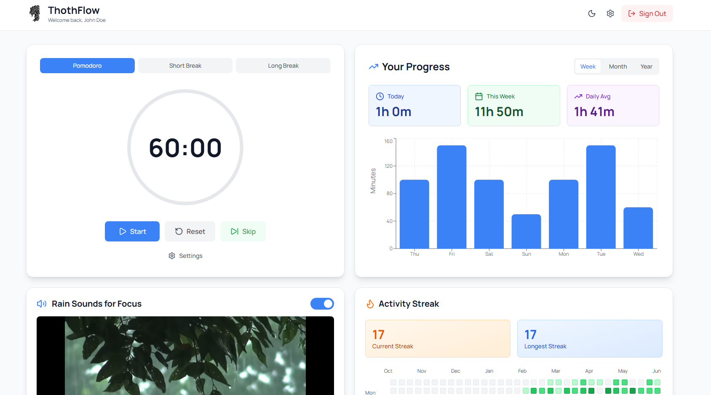

# ThothFlow


A Pomodoro productivity app with streak tracking, focus statistics, ambient sounds, and a weekly leaderboard — built with Next.js 15, Supabase, and TailwindCSS.



---

## What is the Pomodoro Technique?

Work for **25 minutes**, then take a **5-minute break**. After 4 rounds, take a longer **15-minute break**. ThothFlow automates all of this for you.

---

## Features

- **Pomodoro Timer** — focus/short break/long break cycles with a visual progress ring
- **Statistics Panel** — weekly, monthly, and yearly focus charts
- **Streak Tracker** — GitHub-style activity heatmap + current streak
- **Weekly Leaderboard** — see how you rank against all users this week
- **Rain Sound Player** — ambient focus sounds
- **Dark Mode** — full light/dark theme support
- **Cross-device sync** — timer state persists when you switch tabs or devices

---

## Tech Stack

| Layer | Technology |
|---|---|
| Framework | Next.js 15 (App Router, Turbopack) |
| UI | React 19, TailwindCSS |
| State | Zustand |
| Auth & Database | Supabase (PostgreSQL) |
| Charts | Recharts |
| Language | TypeScript (strict mode) |

---

## Prerequisites

Before you begin, make sure you have:

- [Node.js 18+](https://nodejs.org/) installed
- A free [Supabase account](https://supabase.com/)
- Git

---

## Step 1 — Clone the Repository

```bash
git clone https://github.com/kaanx03/focusflow-app.git
cd focusflow-app
```

---

## Step 2 — Install Dependencies

```bash
npm install
```

---

## Step 3 — Create a Supabase Project

1. Go to [supabase.com](https://supabase.com/) and sign in
2. Click **New project**
3. Give it a name (e.g. `thothflow`), choose a region, set a database password
4. Wait ~2 minutes for it to finish provisioning

---

## Step 4 — Set Up the Database Schema

### Fresh install (new Supabase project)

1. In your Supabase project, click **SQL Editor** in the left sidebar
2. Click **New query**
3. Open `schema.sql` from this repo, copy **all** of its contents, and paste into the SQL Editor
4. Click **Run** (or press `Ctrl+Enter`)

This creates three tables and the leaderboard function:

| Table / Function | Purpose |
|---|---|
| `pomodoro_sessions` | Every completed focus session |
| `active_pomodoro_sessions` | Current running/paused timer state |
| `user_settings` | Per-user timer preferences |
| `get_weekly_leaderboard()` | Aggregated weekly ranking |

## Step 5 — Get Your Supabase API Keys

1. In your Supabase project, go to **Settings → API** (left sidebar → gear icon → API)
2. Copy the following values:

| Setting | Where to find it |
|---|---|
| **Project URL** | "Project URL" field at the top |
| **Anon / Public key** | Under "Project API keys" → `anon` `public` |
| **Service Role key** | Under "Project API keys" → `service_role` (click to reveal) |

---

## Step 6 — Configure Environment Variables

In the root of the project, create a file called `.env.local`:

```bash
# On Mac / Linux
cp .env.example .env.local

# On Windows
copy .env.example .env.local
```

Open `.env.local` and fill in your values:

```env
NEXT_PUBLIC_SUPABASE_URL=https://your-project-id.supabase.co
NEXT_PUBLIC_SUPABASE_ANON_KEY=your-anon-public-key-here
SUPABASE_SERVICE_ROLE_KEY=your-service-role-key-here
RESEND_API_KEY=re_your-resend-api-key-here
```

> **Note:** `RESEND_API_KEY` is only needed if you add email features. The app works without it.

---

## Step 7 — Run the Development Server

```bash
npm run dev
```

Open [http://localhost:3000](http://localhost:3000) in your browser.

Create an account, complete a Pomodoro, and watch your stats update in real time.

---

## Step 8 — Enable Email Confirmation (Optional)

By default Supabase requires email confirmation before users can sign in.

To **disable** it for easier local development:
1. Go to **Authentication → Providers → Email** in your Supabase project
2. Toggle off **"Confirm email"**
3. Click **Save**

---

## Available Scripts

```bash
npm run dev      # Start development server (Turbopack)
npm run build    # Build for production
npm start        # Start production server
npm run lint     # Run ESLint
```

---

## Project Structure

```
src/
├── app/
│   ├── dashboard/        # Main protected page
│   ├── login/            # Login page
│   ├── signup/           # Signup page
│   └── layout.tsx        # Root layout (wraps app with providers)
├── components/
│   ├── pomodoro/         # PomodoroTimer
│   ├── stats/            # StatsPanel (charts)
│   ├── layout/           # Navbar
│   ├── Leaderboard.tsx   # Weekly leaderboard
│   ├── StreakTracker.tsx  # Heatmap + streak stats
│   └── RainSoundPlayer.tsx
├── lib/
│   ├── supabase.ts       # Supabase browser client
│   ├── auth-context.tsx  # Auth state provider
│   └── theme-provider.tsx
├── store/
│   ├── pomodoro-store.ts # Zustand timer state
│   └── theme-store.ts
└── types/
    └── index.ts          # TypeScript types
```

---

## Database Schema Reference

### `pomodoro_sessions`

| Column | Type | Description |
|---|---|---|
| `id` | uuid | Primary key |
| `user_id` | uuid | References `auth.users` |
| `duration_minutes` | integer | Length of the session in minutes |
| `session_type` | text | `pomodoro`, `short_break`, or `long_break` |
| `task_name` | text | Optional task label (nullable) |
| `completed_at` | timestamptz | When the session finished |

### `active_pomodoro_sessions`

| Column | Type | Description |
|---|---|---|
| `id` | uuid | Primary key |
| `user_id` | uuid | References `auth.users` (unique — one per user) |
| `session_type` | text | Current session type |
| `total_duration` | integer | Full duration in seconds |
| `time_remaining` | integer | Seconds left when paused |
| `is_active` | boolean | `true` = running, `false` = paused |
| `started_at` | timestamptz | When the session began |
| `paused_at` | timestamptz | When it was paused (null if active) |
| `end_time` | timestamptz | Calculated finish time (null if paused) |
| `completed_pomodoros` | integer | How many pomodoros done this cycle |
| `created_at` | timestamptz | Row creation time |
| `updated_at` | timestamptz | Auto-updated on every change |

### `user_settings`

| Column | Type | Default | Description |
|---|---|---|---|
| `id` | uuid | | Primary key |
| `user_id` | uuid | | References `auth.users` (unique) |
| `pomodoro_duration` | integer | `1500` | Focus duration in seconds (25 min) |
| `short_break_duration` | integer | `300` | Short break in seconds (5 min) |
| `long_break_duration` | integer | `900` | Long break in seconds (15 min) |
| `long_break_interval` | integer | `4` | Pomodoros before a long break |
| `auto_start_breaks` | boolean | `true` | Auto-start break timers |

> A database trigger automatically creates a `user_settings` row with defaults whenever a new user signs up — you don't need to do anything.

---

## Troubleshooting

**"supabaseUrl is required" error on startup**
→ Your `.env.local` file is missing or the dev server hasn't been restarted after creating it. Stop the server (`Ctrl+C`) and run `npm run dev` again.

**Login works but dashboard is blank / spinning**
→ The database tables don't exist yet. Make sure you ran `schema.sql` in the Supabase SQL Editor (Step 4).

**Leaderboard shows "No sessions this week yet"**
→ Either the `get_weekly_leaderboard` function wasn't created (re-run `schema.sql`) or no one has completed a Pomodoro session in the last 7 days.

**Email confirmation loop on signup**
→ Disable "Confirm email" in Supabase → Authentication → Providers → Email (see Step 8).

---

## Deployment

The easiest way to deploy is [Vercel](https://vercel.com/):

1. Push your code to GitHub
2. Import the repo in Vercel
3. Add your environment variables in the Vercel project settings (same keys as `.env.local`)
4. Deploy

> Make sure to add your production domain to **Supabase → Authentication → URL Configuration → Allowed Redirect URLs**.

---

## License

MIT — see [LICENSE](LICENSE) for details.
